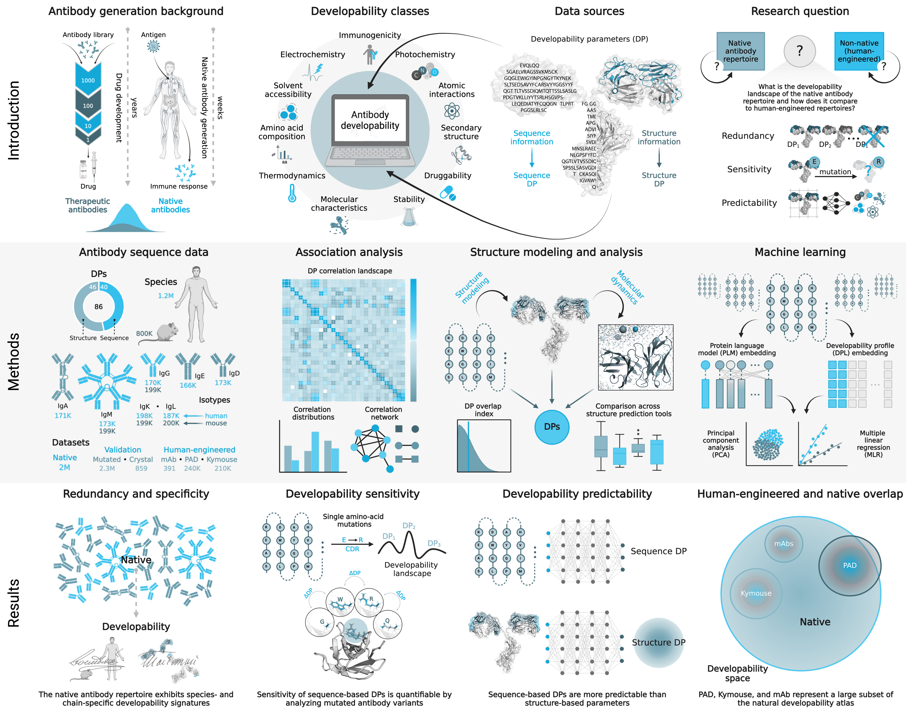

# Redundancy, predictability and sensitivity of the developability landscapes of natural and engineered antibody repertoires

## Overview

Therapeutic monoclonal antibodies (mAbs) need to not only show high target-specificity but also demonstrate favorable developability. The term “developability” refers to a multi-parameter design element that measures the manufacturability of an antibody candidate via evaluating its biophysical characteristics, reflecting its potential to progress from discovery to clinical application. Computational developability parameter (DP) profiling now enables the assessment of antibody developability at high-throughput. While it has been suggested that natural antibody repertoires provide valuable guidance for therapeutic antibody selection, we lack comprehensive quantification of natural DP plasticity (redundancy, predictability, and sensitivity) and how the DP landscapes of human-engineered and natural antibodies relate to one another. To address these knowledge gaps, we assembled a dataset comprising over two million natural and human-engineered antibodies (patent-submitted, therapeutic, and kymouse), predicted their structures and computed their DPs (40 sequence-based and 46 structure-based DPs). We show that the developability landscapes across species (mouse, human) and chain (heavy, light) harbor distinct signatures. We report greater redundancy and higher predictability among sequence DPs, as opposed to structure-based ones, suggesting a less restricted design space for structural developability considerations. We found minimal correlation between sequence and developability similarity, highlighting the considerable developability shifts introduced with minimal sequence alterations. Using molecular dynamics simulations, we discovered that current antibody structure prediction tools could be providing (developability) snapshots of the conformational ensemble. Finally, based on the DPs explored, we found that the developability spaces of human-engineered antibodies are mere subspaces of the natural ones. By charting the extent of the antibody developability space, we contribute to the long-standing goal of in silico and rational therapeutic antibody design.

## Availability

Code and datasets are currently being uploaded and will be available soon. For reference, please cite our paper titled "Cartography of the Developability Landscapes of Native and Human-Engineered Antibodies" which is currently available as a preprint: https://www.biorxiv.org/content/10.1101/2023.10.26.563958v1. The material included in this study is made avalialable under a CC-BY-NC-ND 4.0 International license.

